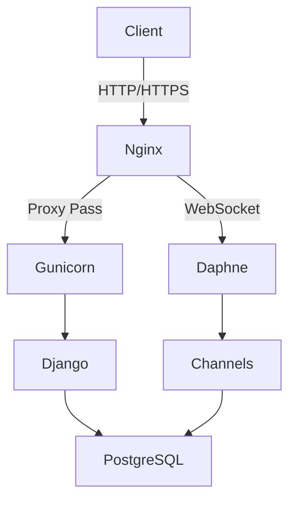
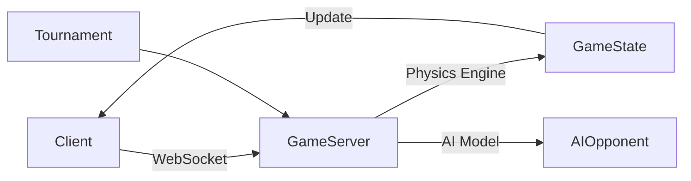

# ft_transcendence

Final project of the 42 Common Core - A real-time multiplayer Pong web application with social features.

## Overview

ft_transcendence is a full-stack web application that reimagines the classic Pong game with modern web technologies and social features. Built with Django, PostgreSQL, and vanilla JavaScript, it offers real-time multiplayer gameplay, tournaments, and social networking capabilities.

## Key Features

### 🎮 Game Features
- Real-time multiplayer Pong using WebSocket communication
- Tournament system with bracket-style competitions
- AI opponent trained with NEAT (NeuroEvolution of Augmenting Topologies)
- 3D game visualization using Three.js
- Server-side game engine for fair play
- Global ranking ladder system

### 👤 Social Features
- User profiles with customizable avatars
- Friend system with request management
- Real-time online status tracking
- Detailed match history and statistics
- Global leaderboard

### 🔐 Security
- TLS encryption for all communications
- JWT-based authentication
- CSRF protection
- GDPR-compliant data handling
- Two-factor authentication (2FA)
- Secure password recovery system

## Technical Stack

### Backend
- **Framework:** Django + Django Channels
- **Database:** PostgreSQL
- **Authentication:** JWT + OAuth2 (42 School integration)
- **WebSocket:** Django Channels + ASGI
- **AI:** NEAT-Python for AI opponent

### Frontend
- **Core:** Vanilla JavaScript (No frameworks)
- **UI Framework:** Bootstrap
- **3D Graphics:** Three.js
- **Real-time:** WebSocket API

### Infrastructure
- **Server:** Gunicorn + Daphne
- **Reverse Proxy:** Nginx
- **Containerization:** Docker + Docker Compose

## Architecture Overview

### REST API Design


### Game Architecture


## Project Structure
```
ft_transcendence/
├── data/
│   └── web/
│       ├── backend/       # Django apps
│       ├── pong/         # Game logic
│       ├── tournaments/  # Tournament system
│       ├── authservice/  # Authentication
│       └── static/       # Frontend assets
├── srcs/
│   └── requirements/
│       ├── django/      # Django configuration
│       ├── nginx/       # Nginx configuration
│       └── postgres/    # Database configuration
└── docker-compose.yml   # Container orchestration
```